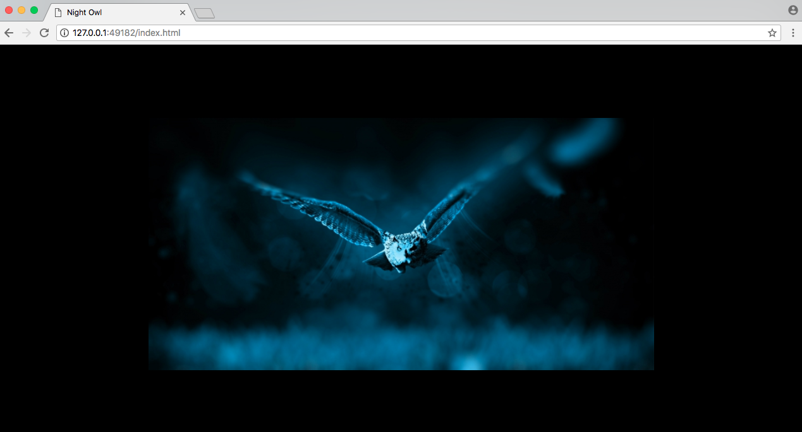
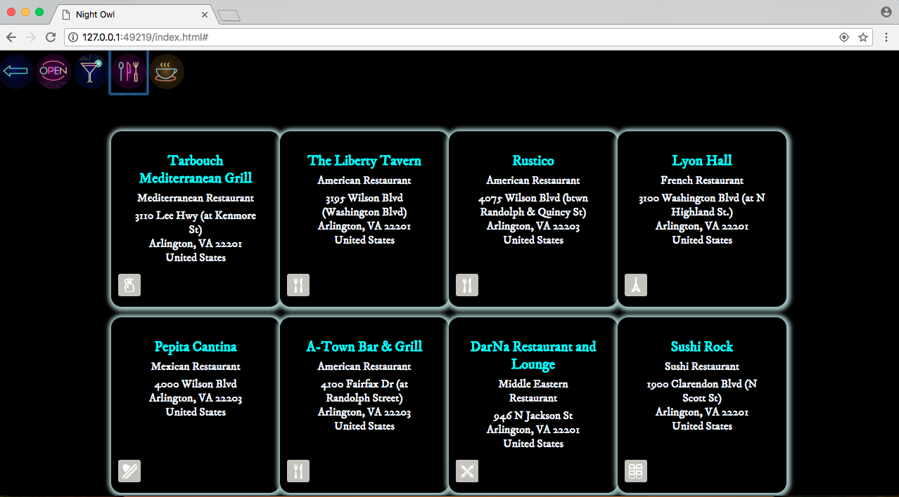
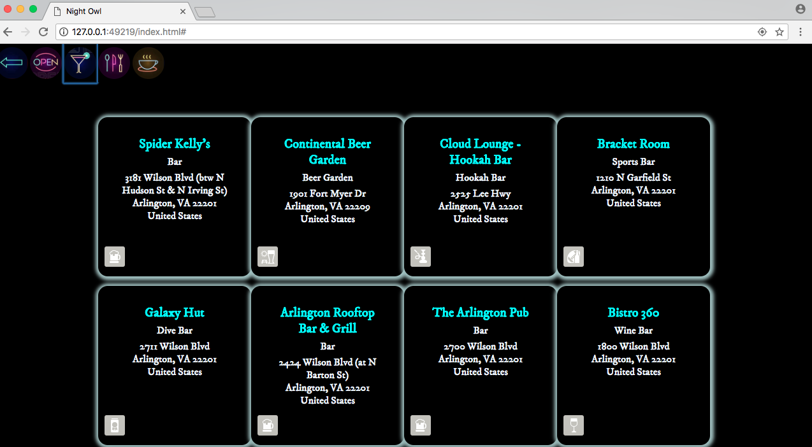

# night-owl-api-capstone
Night Owl is a simple app that allows users to find nightlife spots - whether it's a bar, a restaurant, or a coffee shop - that are currently open near them.

## Use Case
Why is this app useful? This simplicity of this app will immediately cater to the needs of anyone looking for a bar, a restaruant, or a coffee shop that is open late at night.

## User-stories

##### Find places near me.
* As a user I should be able to understand the purpose of the app based off the landing page to use the app.
* As a user, I should be able to allow or deny the computer to know my location in order to search cafes and restaurants near me.
* As a user I should be able to see the place’s details including its name, category, and address.
* As a user I should be able to return to the landing page to start a new search.

##### Screen Inventory
* Landing page with a button to start the search
* Results page with 4 icons (back button, bars button, restaurants button, and coffee shops button)
* Results presented in cells

##### Wireframes
* Wireframe to understand purpose.

* Wireframe to show the search forms including the “near me,” “zip code,” and “late night” options.
* Wireframes to show the map with the point of interest pins with the results under it.

## Working Prototype
You can access a working prototype of the app here: https://jebbyblah007.github.io/night-owl-api-capstone/

## Functionality
The app's functionality includes:

* Landing page that includes a button to search nearby places that are currently open.
* An arrow button that will take the user back to the landing page.
* Three buttons to click on depending on what specific category a user is looking for.

## Technical
The app is built with HTML, CSS, JavaScript, and jQuery. It has been built to be fully responsive across mobile, tablet and desktop screen resolutions.

## Development Roadmap
This is v1.0 of the app, but future enhancements are expected to include:

* Add a map.
